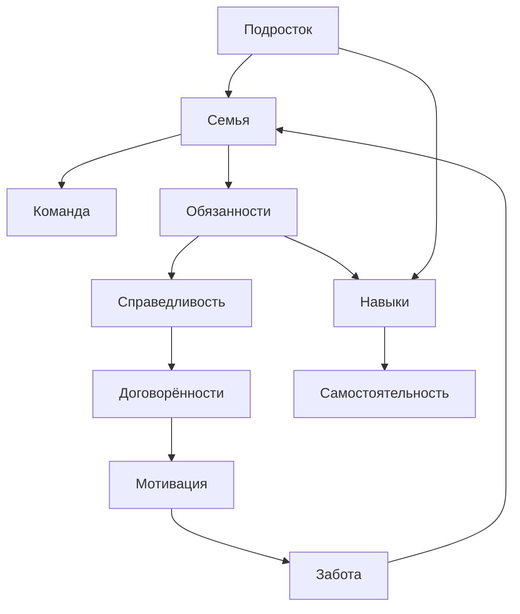

# Я и повседневная жизнь (Обязанности в семье)

**Студент:** Бобович Андрей Павлович  
**Группа:** М8О-105СВ-26  
**Раздел:** Я и повседневная жизнь (Домашние обязанности)

---

## Что я делал

Выбрал тему про домашние обязанности и семейные отношения — это основа раздела о повседневной жизни. Написал статьи о мытье посуды, справедливом распределении дел, мотивации и навыках для взрослой жизни. Разобрался с WikiData и SPARQL, построил онтологию из понятий, которые удалось найти в базе.

---

## Понятия и связи между ними

Я выделил 10 понятий, которые описывают тему домашних обязанностей и взросления с разных сторон:

| Понятие | Описание |
|---------|----------|
| **Подросток** | главный герой, от чьего лица ведётся повествование |
| **Семья** | базовая среда, где формируются отношения и распределение дел |
| **Обязанности** | конкретные дела, которые нужно выполнять (мытьё посуды, уборка) |
| **Справедливость** | ключевой принцип распределения нагрузки (не поровну, а по силам) |
| **Договорённости** | способ сделать совместную жизнь комфортной через обсуждение |
| **Мотивация** | внутренние и внешние приёмы, чтобы начать неприятное дело |
| **Забота** | альтернативный взгляд на домашние дела как проявление внимания к близким |
| **Команда** | метафора семьи, где каждый вносит вклад в общий результат |
| **Навыки** | практические умения, которые пригодятся во взрослой жизни |
| **Самостоятельность** | конечная цель: способность заботиться о себе без принуждения |

### Как они связаны между собой

- **Подросток** является частью **Семьи**
- **Семья** функционирует как **Команда**
- В семье существуют **Обязанности**
- Распределение обязанностей основывается на **Справедливости**
- **Справедливость** достигается через **Договорённости**
- **Договорённости** создают **Мотивацию**
- **Мотивация** проявляется в **Заботе** о близких
- **Забота** укрепляет **Семью**
- **Обязанности** помогают развивать **Навыки**
- **Навыки** ведут к **Самостоятельности**
- **Подросток** напрямую развивает **Навыки** через деятельность

---

## Схема онтологии



## SPARQL-запрос

Использовал один запрос — на получение понятий и их описаний из WikiData:

```sparql
SELECT ?item ?itemLabel ?description WHERE {
  VALUES ?item {
    wd:Q4368245       # подросток
    wd:Q8436          # семья
    wd:Lexeme:L136354 # обязанность
    wd:Q6316865       # справедливость
    wd:Lexeme:L106803 # договорённость
    wd:Q644302        # мотивация
    wd:Q2421951       # забота
    wd:Q1079196       # команда
    wd:Q205961        # навык
    wd:Q3236990       # самостоятельность
  }

  SERVICE wikibase:label { bd:serviceParam wikibase:language "ru,en". }

  OPTIONAL {
    ?item schema:description ?description .
    FILTER(LANG(?description) = "ru")
  }
}
```
Запрос на прямые связи между понятиями тоже писал, но WikiData вернула 0 результатов — абстрактные социальные концепты между собой там почти не связаны. Поэтому связи в онтологии расставлены вручную.
Результат запроса: data/wikidata_export.json

## Как шла работа

Зашел Wikidata и искал там понятия похожие на те темы, по которым писались статьи в папке WEB.

Онтологию рисовал пробовал рисовать через Graphviz и Matplotlib, в итоге остановился на простой иерархической схеме на Graphviz.

Хотел сделать также автоматическое определение связей между понятиями, но прямых и очевидных связей запрос не выдавал

Статьи писал в разговорном стиле, ориентировался на подростковую аудиторию — это оказалось сложнее, чем казалось: хочется и по делу сказать, и не скатиться в занудство.

## Личные ощущения

Больше всего времени ушло не на код, а на то, чтобы найти правильные понятия в WikiData. База большая, но социальная тематика там покрыта слабо — многие очевидные связи просто отсутствуют.

Graphviz понравился, так минимум кода, результат сразу читаемый. SPARQL тоже оказался логичным, хотя поначалу синтаксис выглядит страшно.
